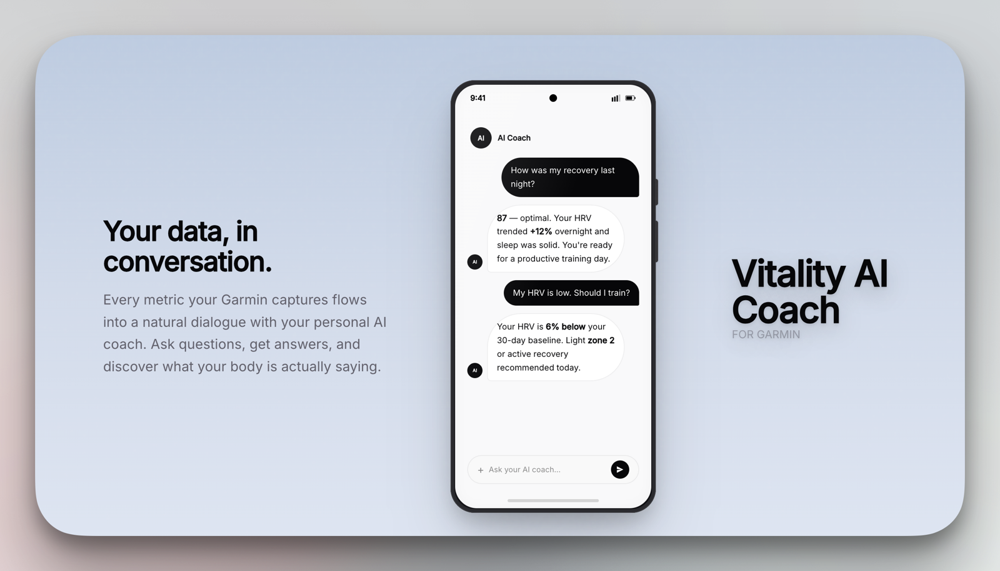

<div align="center">



# 💚 Vitality AI Coach for Garmin

<p>
  <em>Self-hostable AI health & fitness coach — reads your <strong>Garmin Connect</strong> data and
  answers questions about training, sleep, stress, recovery and body battery.</em>
</p>

<p>
  <a href="LICENSE"></a>
  <a href="https://www.python.org/"></a>
  <a href="https://nodejs.org/"></a>
  <a href="https://www.docker.com/"></a>
  <a href="#hosted-deployment"></a>
  <a href="#install-with-ai-agents"></a>
  <a href="https://github.com/ArtemKx1/vitality-ai-coach-public/stargazers"></a>
</p>

**100% self-hosted** &nbsp;·&nbsp; **bring your own model** &nbsp;·&nbsp; **zero-config wizard** &nbsp;·&nbsp; **no telemetry**

<sub><a href="#features">✨ Features</a> · <a href="#install-with-ai-agents">🤖 AI Agents</a> · <a href="#one-command-docker">🚀 Docker</a> · <a href="#install-locally">📦 Local</a> · <a href="#configuration">⚙️ Config</a> · <a href="#local-model-ollama">🦙 Ollama</a> · <a href="#development">🛠 Dev</a> · <a href="#hosted-deployment">☁️ Hosted</a> · <a href="#privacy--security">🔒 Privacy</a> · <a href="#faq">❓ FAQ</a> · <a href="#license">📄 License</a></sub>

</div>

---

## ✨ Features

- **🔒 100% self-hosted** — your Garmin credentials and chat history stay on your
  machine (encrypted with `APP_SECRET_KEY`). Only the LLM provider you pick
  ever sees your data.
- **🧠 Bring your own model** — Groq, OpenRouter, OpenAI, Mistral, any
  OpenAI-compatible endpoint, or **local Ollama** (fully offline).
- **🪄 Zero-config setup** — first-run wizard in the browser: connect AI → create
  your account → connect Garmin → start chatting. No terminal gymnastics.
- **📈 Data you actually care about** — sleep, HRV, training load, stress,
  recovery and body battery, explained in your own language.

---

## 🤖 Install with AI agents

Clone the repo, then let **Claude Code**, **Codex** or **opencode** do the rest —
they read [`AGENTS.md`](AGENTS.md) automatically:

```bash
git clone https://github.com/ArtemKx1/vitality-ai-coach-public.git
cd vitality-ai-coach-public
```

| Agent | Command |
|---|---|
| **Claude Code** | `claude "Set up this repo and verify it runs locally"` |
| **Codex** (OpenAI) | `codex "Set up this repo and verify it runs locally"` |
| **opencode** | `opencode "Set up this repo and verify it runs locally"` |

No CLI installed, or pasting into a chat? Copy this block into any AI agent
(ChatGPT, Claude, Gemini…) with the repo already cloned:

```text
Set up Vitality AI Coach for Garmin locally and verify it runs.

1. Backend: create a Python venv, install deps (`pip install -e ".[dev]"`),
   and copy `.env.example` → `.env`.
2. LLM: set an LLM_PROVIDER with a working key. Prefer Groq (free tier, no
   credit card); if you have no key, leave it and tell me to use the browser
   wizard or local Ollama instead.
3. Frontend: `cd frontend && npm install && npm run build` (VITE_BASE=/).
4. Start the server: `uvicorn src.main:app --host 0.0.0.0 --port 8000`.
5. Verify: `GET /health` returns ok, and `GET /api/v1/setup/status` returns
   `{"setup_required": true, ...}`.
6. Tell me to open http://localhost:8000 for the first-run wizard.

Rules: never commit `.env`; never touch `data/`; never regenerate
APP_SECRET_KEY if one already exists.
```

---

## 🚀 One-command install (Docker)

**Requirements:** Docker with Compose v2.

```bash
curl -fsSL https://raw.githubusercontent.com/ArtemKx1/vitality-ai-coach-public/main/start.sh -o start.sh
bash start.sh
```

The script detects Docker, downloads the compose files, creates `.env` if
needed, and starts the app — pulling the prebuilt image from GHCR, or building
from source if the image isn't available yet. Then it opens
**http://localhost:8000**.

Manual equivalent (builds from source):

```bash
cp .env.example .env          # defaults are fine — the wizard handles the rest
docker compose -f compose.build.yaml up -d --build
open http://localhost:8000
```

---

## 📦 Install locally

**Requirements:** Python 3.11+ and Node 20+. A Garmin account. One LLM API key
(free tiers work — e.g. Groq) or local Ollama.

```bash
git clone https://github.com/ArtemKx1/vitality-ai-coach-public.git
cd vitality-ai-coach-public

# Backend (Python)
python3 -m venv .venv
source .venv/bin/activate
pip install -e ".[dev]"

cp .env.example .env

# Frontend (React SPA) — build once; the backend serves it at :8000
cd frontend
npm install
npm run build          # VITE_BASE=/ (self-host at the root)
cd ..

# Run — SQLite DB auto-initializes, the first-run wizard shows in the browser
uvicorn src.main:app --host 0.0.0.0 --port 8000
```

Open **http://localhost:8000** — you'll be taken to the setup wizard. It walks
you through:

1. **AI provider** — pick Groq/OpenRouter/OpenAI/Mistral/Ollama, paste a key
   (or nothing for Ollama).
2. **Your account** — email/password + optional Garmin Connect login.
3. **Done** — chat about your sleep, HRV, training load and more.

> Using `uv`? Then `uv sync` replaces the venv + pip steps.

---

## ⚙️ Configuration

All settings come from environment variables (`.env`) or the setup wizard
(which writes `data/config.json`). Key ones:

| Variable | Default | Purpose |
|---|---|---|
| `LLM_PROVIDER` | `auto` | `ollama`, `groq`, `openrouter`, `openai`, `openai_compatible`, `mistral`, `auto` |
| `GROQ_API_KEY` / `OPENROUTER_API_KEY` / `OPENAI_API_KEY` / `MISTRAL_API_KEY` | — | keys for cloud providers (free tiers available) |
| `OLLAMA_HOST` / `OLLAMA_MODEL` | `http://localhost:11434` | local LLM (fully offline) |
| `DATABASE_URL` | `sqlite:///./data/garmin_coach.db` | SQLite by default; use Postgres for multi-user hosting |
| `APP_SECRET_KEY` | auto-generated | **encrypts** Garmin credentials + chat messages; never regenerate it |
| `SCHEDULER_ENABLED` | `true` | built-in background sync (set `false` if you use external cron) |

See `.env.example` for the full list. Optional features (push notifications,
text-to-speech, social login) degrade gracefully when not configured.

---

## 🦙 Using a local model (Ollama)

```bash
ollama pull gemma4:e4b          # or any model you like
docker compose -f compose.build.yaml up -d --build
# set LLM_PROVIDER=ollama, OLLAMA_HOST=http://ollama:11434 in .env
```

Fully offline: nothing leaves your machine.

---

## 🛠 Development

```bash
python3 -m venv .venv && source .venv/bin/activate
pip install -e ".[dev]"
cp .env.example .env
uvicorn src.main:app --reload --port 8000          # API

cd frontend && npm install && npm run dev           # SPA (Vite dev server)
```

Backend tests: `python3 -m pytest tests/ -q`. Pre-publish secret scan:
`./scripts/check-secrets.sh`.

---

## 🐳 Building the image yourself

```bash
docker build -t vitality-ai-coach .
docker run -p 8000:8000 -v "$PWD/data:/app/data" vitality-ai-coach
```

---

## ☁️ Hosted deployment

A prebuilt image is published to GHCR (`ghcr.io/artemkx1/vitality-ai-coach-public`).
Run it directly:

```bash
docker run -d --name vitality-ai-coach -p 8000:8000 \
  -v "$PWD/data:/app/data" \
  ghcr.io/artemkx1/vitality-ai-coach-public:latest
```

Set secrets (`APP_SECRET_KEY`, `DATABASE_URL`, LLM keys) via environment
variables or a `.env` file — never in git. For multiple instances, disable the
in-process scheduler and trigger `/api/v1/internal/sync-all-active` from an
external cron.

---

## 🔒 Privacy & security

- Garmin credentials and chat history are Fernet-encrypted at rest.
- `APP_SECRET_KEY` is generated on first boot (stored in `data/.secret`).
  Back it up — losing it makes stored data unrecoverable.
- This app only ever talks to: your LLM provider, Garmin Connect (to sync your
  data), and the services you explicitly configure. **No telemetry.**

---

## ❓ FAQ

**Does this phone home?**
Only to the services you configure: your LLM provider and Garmin Connect (to
sync your data). No telemetry.

**What happens to my Garmin password?**
It is encrypted with `APP_SECRET_KEY` and sent only to Garmin Connect when
syncing.

**Which models work?**
Any OpenAI-compatible chat model. Local Ollama is fully free and private.

**The wizard is gone / shows 403?**
Setup is only available before the first account is created. Change settings via
environment variables afterwards.

**Can an AI agent install it for me?**
Yes — see [Install with AI agents](#install-with-ai-agents). Claude Code, Codex
and opencode read `AGENTS.md` automatically.

---

## 📁 Project layout

```
├── src/                  # FastAPI backend (Python)
│   ├── main.py           # App entry, SPA serving, rate limits
│   ├── api/              # Routes: auth, chat, sync, insights, background_sync, setup
│   ├── agents/           # LLM agents: fitness_coach, health_analyst, orchestrator
│   ├── db/               # SQLAlchemy models + migrations/
│   ├── garmin/           # Garmin Connect client
│   ├── services/         # context, data_sync, insights, tts, firebase, scheduler
│   └── config.py         # Settings from env vars + runtime config overlay
├── frontend/             # React SPA (Vite + TypeScript + Tailwind 4)
├── scripts/              # check-secrets.sh (secret scan before publishing)
├── tests/                # Backend tests (pytest)
├── Dockerfile            # Multi-stage build (frontend + API)
├── compose.yaml          # One-command self-hosting (prebuilt image)
├── compose.build.yaml    # Build from source (dev / pre-release)
└── start.sh              # One-command installer
```

---

## 📄 License

[MIT](LICENSE)
